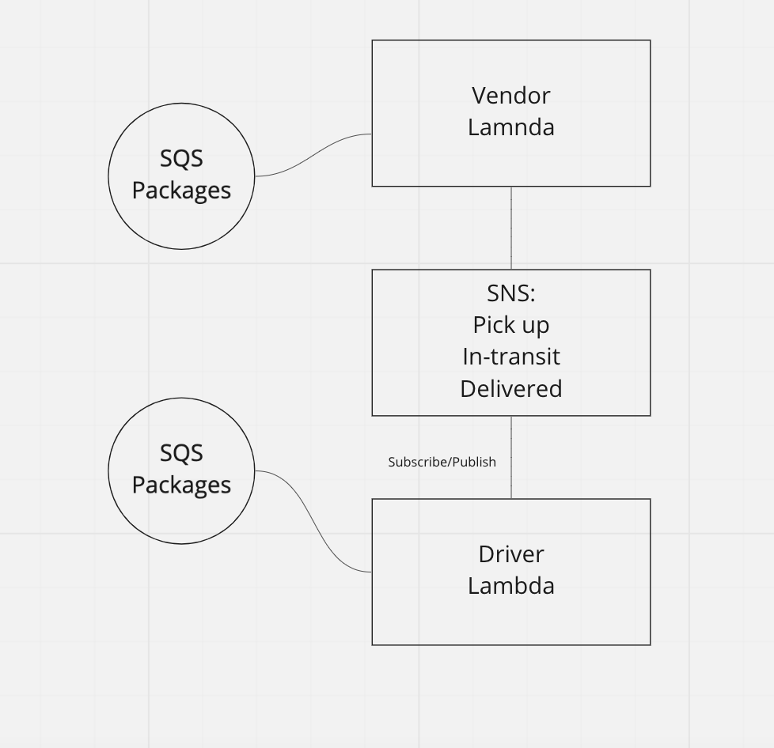

# caps-cloud

## Overview: 
- Using AWS Services: SQS, SNS, Lambda, create a cloud version of the CAPS system

## Required Services
1. SNS Topic: pickup which will receive all pickup requests from vendors
2. SQS Queue (FIFO): packages which will contain all delivery requests from vendors, in order of receipt.
   - Subscribe this queue to the pickup topic so all pickups are ordered
3. SQS Queue (Standard) for each vendor (named for the vendor) which will contain all delivery notifications from the drivers  

## Operations  

### Vendors:
- Vendors will post “pickup” messages containing delivery information into the SNS pickup topic

### Drivers:  
- Drivers will poll the SQS packages queue and retrieve only the next delivery order (message) 

#### SNS Topics
**Pickup**
- Publisher - Vendor
- Subscriber - Driver

**In-Transit**
- Publisher - Driver
- Subscriber - Vendor

**Delivery**
- Publisher - Driver
- Subscriber - Vendor

#### SQS

**Packages**
- All packages from vendors go into the SQS packages FIFO queue and are pulled by the driver.

**Vendors Packages**
- A vendor would put a copy of a package for pickup into its own queue to track that its been shipped. Once the package has been delivered, it gets removed from the queue and is no longer tracked.

### UML

